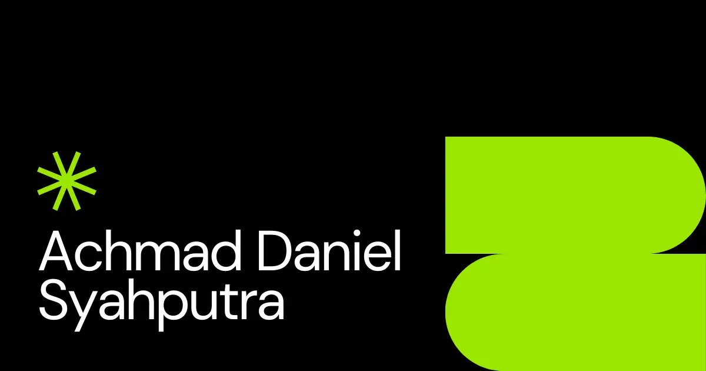

# Hi 👋 Welcome to My Digital Playground



## About This Portfolio

This is my personal portfolio built with **Next.js 16**. It’s a living space for my work, ideas, and experiments.
All motion is handcrafted with **GSAP** for smooth micro-interactions and delightful transitions.

Live at [achmaddaniel.nielcode.com](https://achmaddaniel.nielcode.com), available in English and Indonesian.

## Tech Stack

- **Framework**: Next.js 16 (App Router), React 19
- **Language**: TypeScript
- **Styling**: Tailwind CSS v4
- **Animations**: GSAP (ScrollTrigger), Lenis smooth scroll, and OGL for WebGL effects
- **i18n**: `/en` and `/id` routes with locale detection in `src/proxy.ts`
- **Deploy**: Vercel

## Getting Started

> **Requirements:** Node.js 20.9+ and [Bun](https://bun.sh).

```bash
# 1) Install deps
bun install

# 2) Copy env vars and fill them in
cp .env.example .env

# 3) Start dev server
bun dev
```

Other scripts:

```bash
bun run build   # production build
bun start       # serve the production build
bun run lint    # ESLint
```

### Environment Variables

| Variable                               | Purpose                                      |
| -------------------------------------- | -------------------------------------------- |
| `NEXT_PUBLIC_CV_EN`                    | Resume link (English) for the hero button    |
| `NEXT_PUBLIC_CV_ID`                    | Resume link (Indonesian) for the hero button |
| `NEXT_PUBLIC_GOOGLE_SITE_VERIFICATION` | Google Search Console verification token     |

## Get In Touch

Want to collaborate or just say hi? I'm always open to interesting conversations!

- **Email**: <achmaddaniel@nielcode.com>
- **LinkedIn**: [Achmad Daniel](https://www.linkedin.com/in/achmaddaniel)

## Support

If you find value in my projects, consider [buying me a coffee](https://www.buymeacoffee.com/kudanil)! Your support fuels my passion and helps me continue creating.

Made with ❤️ and ☕ by Achmad Daniel
